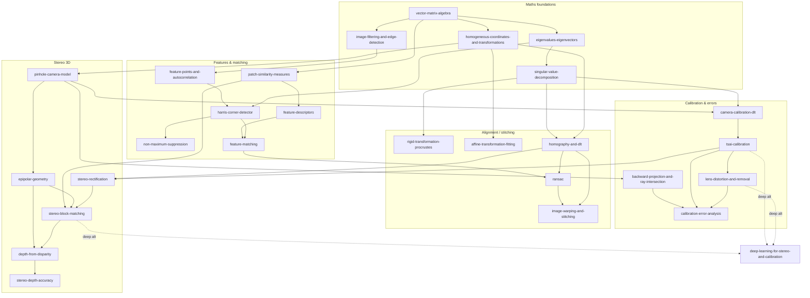

# COMPSCI 773 — Topic Map & Taxonomy

Exam-ready reference library for **Intelligent Vision Systems** (University of Auckland). Every topic is one file with sections A1–A6 (Purpose · Overview+definitions · Strengths/limits+exam Qs · Directions of reasoning · Implementation · Variations). Notation is consistent across all files (see [topic index](../outputs/topic_index.md)).

The course is two pipelines bolted onto a shared maths/feature core:
1. **Image alignment / panorama stitching** (W1–W7): detect → describe → match → fit transform → warp.
2. **Stereo 3D reconstruction** (W7–W11): calibrate → rectify → match → triangulate depth, plus error/distortion analysis and deep-learning methods.

---

## The two end-to-end pipelines

**Panorama / image-alignment pipeline** (the "robust feature-based alignment" loop):
`detect keypoints` → `describe` → `match (+ratio test)` → `RANSAC-fit transform` → `warp & blend`
[[feature-points-and-autocorrelation]] → [[harris-corner-detector]] → [[feature-descriptors]] → [[feature-matching]] → [[ransac]] (fitting [[homography-and-dlt]]) → [[image-warping-and-stitching]]

**Binocular stereo pipeline** (5 stages):
`acquire + undistort` → `calibrate` → `rectify` → `stereo match` → `triangulate → point cloud`
[[lens-distortion-and-removal]] → [[tsai-calibration]] → [[stereo-rectification]] → [[stereo-block-matching]] → [[depth-from-disparity]] (accuracy: [[stereo-depth-accuracy]])

---

## Relationship table

| Topic | Depends on (prerequisites) | Used inside / feeds | Specialises / relates to |
|---|---|---|---|
| [[vector-matrix-algebra]] | — | almost everything | foundation |
| [[eigenvalues-eigenvectors]] | [[vector-matrix-algebra]] | [[harris-corner-detector]], [[singular-value-decomposition]] | ellipse geometry |
| [[singular-value-decomposition]] | [[eigenvalues-eigenvectors]] | [[homography-and-dlt]], [[rigid-transformation-procrustes]], [[camera-calibration-dlt]] | homogeneous LS solver |
| [[homogeneous-coordinates-and-transformations]] | [[vector-matrix-algebra]] | all projection/transform topics | model hierarchy (rigid→affine→projective) |
| [[image-filtering-and-edge-detection]] | [[vector-matrix-algebra]] | [[harris-corner-detector]] (gradients) | — |
| [[feature-points-and-autocorrelation]] | [[image-filtering-and-edge-detection]] | [[harris-corner-detector]] | precursor to Harris |
| [[harris-corner-detector]] | [[feature-points-and-autocorrelation]], [[eigenvalues-eigenvectors]] | [[feature-matching]], alignment pipeline | uses [[non-maximum-suppression]] (step 8) |
| [[non-maximum-suppression]] | — | [[harris-corner-detector]] | generic peak filter |
| [[patch-similarity-measures]] | [[vector-matrix-algebra]] | [[feature-descriptors]], [[feature-matching]], [[stereo-block-matching]] | **shared subroutine** (SSD/SAD/CC/NCC) |
| [[feature-descriptors]] | [[patch-similarity-measures]] | [[feature-matching]] | variants: SIFT/HOG/learned |
| [[feature-matching]] | [[feature-descriptors]], [[patch-similarity-measures]] | [[ransac]] | Lowe's ratio test |
| [[rigid-transformation-procrustes]] | [[singular-value-decomposition]] | alignment | 3 dof (simplest model) |
| [[affine-transformation-fitting]] | [[homogeneous-coordinates-and-transformations]] | alignment | 6 dof; inhomogeneous LS |
| [[homography-and-dlt]] | [[singular-value-decomposition]], [[homogeneous-coordinates-and-transformations]] | [[ransac]], [[image-warping-and-stitching]], [[stereo-rectification]] | 8 dof; homogeneous LS |
| [[ransac]] | [[homography-and-dlt]] | [[feature-matching]], [[image-warping-and-stitching]] | robust fitting |
| [[image-warping-and-stitching]] | [[homography-and-dlt]] | panorama output | forward vs inverse warp + bilinear |
| [[pinhole-camera-model]] | [[homogeneous-coordinates-and-transformations]] | calibration, stereo, [[backward-projection-and-ray-intersection]] | $\mathbf{P}=\mathbf{K}[\mathbf{R}\mid\mathbf{t}]$ |
| [[epipolar-geometry]] | [[pinhole-camera-model]] | [[depth-from-disparity]], [[stereo-block-matching]] | canonical geometry ⇒ rectification |
| [[depth-from-disparity]] | [[epipolar-geometry]], [[pinhole-camera-model]] | point cloud | $Z=fb/d$ |
| [[stereo-depth-accuracy]] | [[depth-from-disparity]] | system design | $\Delta Z$, baseline trade-offs |
| [[stereo-block-matching]] | [[patch-similarity-measures]], [[epipolar-geometry]] | [[depth-from-disparity]] | variants: global/Potts, ELAS, deep |
| [[stereo-rectification]] | [[homography-and-dlt]], [[tsai-calibration]] | [[stereo-block-matching]] | Fusiello algorithm |
| [[camera-calibration-dlt]] | [[pinhole-camera-model]], [[singular-value-decomposition]] | calibration | generic linear $\mathbf{P}$ (precursor) |
| [[tsai-calibration]] | [[camera-calibration-dlt]], [[pinhole-camera-model]] | [[stereo-rectification]], [[calibration-error-analysis]] | decomposed, interpretable params |
| [[backward-projection-and-ray-intersection]] | [[pinhole-camera-model]], [[vector-matrix-algebra]] | [[calibration-error-analysis]] | inverse of forward projection |
| [[calibration-error-analysis]] | [[tsai-calibration]], [[backward-projection-and-ray-intersection]] | calibration QA | image / cube / stereo error |
| [[lens-distortion-and-removal]] | [[tsai-calibration]] | undistortion stage | radial/mustache models |
| [[deep-learning-for-stereo-and-calibration]] | [[stereo-block-matching]], [[tsai-calibration]] | modern alternatives | CREStereo / DeepCalib / Parallel RCNN |

---

## Mermaid dependency graph

---

## Suggested revision order

1. **Maths first:** [[vector-matrix-algebra]] → [[eigenvalues-eigenvectors]] → [[singular-value-decomposition]] → [[homogeneous-coordinates-and-transformations]] → [[image-filtering-and-edge-detection]].
2. **Features arc:** [[feature-points-and-autocorrelation]] → [[harris-corner-detector]] → [[non-maximum-suppression]] → [[patch-similarity-measures]] → [[feature-descriptors]] → [[feature-matching]].
3. **Alignment arc:** [[rigid-transformation-procrustes]] → [[affine-transformation-fitting]] → [[homography-and-dlt]] → [[ransac]] → [[image-warping-and-stitching]].
4. **Stereo arc:** [[pinhole-camera-model]] → [[epipolar-geometry]] → [[depth-from-disparity]] → [[stereo-depth-accuracy]] → [[stereo-block-matching]] → [[stereo-rectification]].
5. **Calibration arc:** [[camera-calibration-dlt]] → [[tsai-calibration]] → [[backward-projection-and-ray-intersection]] → [[calibration-error-analysis]] → [[lens-distortion-and-removal]].
6. **Modern methods:** [[deep-learning-for-stereo-and-calibration]].

## High-yield exam anchors (from worked examples & hints)
- **Harris** numeric: $\mathbf{H}=(2219,84;84,115)\Rightarrow C=30226.76$ → corner ([[harris-corner-detector]]).
- **NCC** worked: $-0.125$ and $1293/1300\approx0.9946$ ([[patch-similarity-measures]]).
- **Rigid fit** via SVD: $A,B$ sets $\Rightarrow \mathbf{R}=\mathrm{diag}(-1,-1)$, $\mathbf{t}=(-1,-1)$ ([[rigid-transformation-procrustes]]).
- **Depth manually**: $d_{px}=x_L-x_R$, $\times s$, $Z=fb/d$ ([[depth-from-disparity]]); accuracy $\Delta Z=Z^2/(fb+Z)$ ([[stereo-depth-accuracy]]).
- **Tsai** requires **≥7 non-coplanar** points ([[tsai-calibration]]).
- **Block size & disparityMax** selection ([[stereo-block-matching]]).
- **Distortion** design: $\kappa_1=\Delta/r_d^3$ ([[lens-distortion-and-removal]]).
- **Back-projection** 7 steps + ray–plane intersect ([[backward-projection-and-ray-intersection]]).
